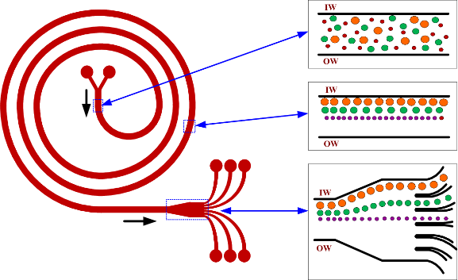
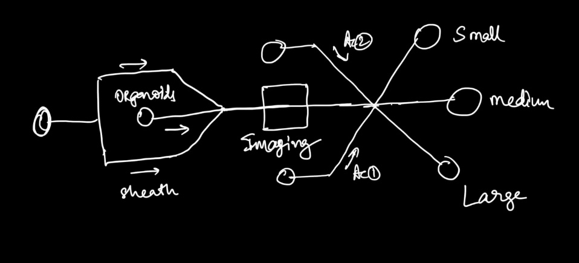
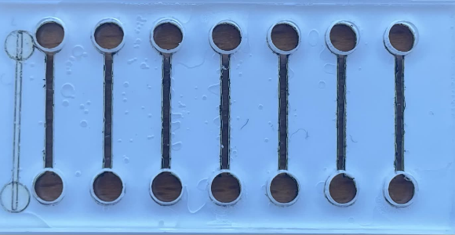
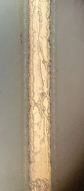
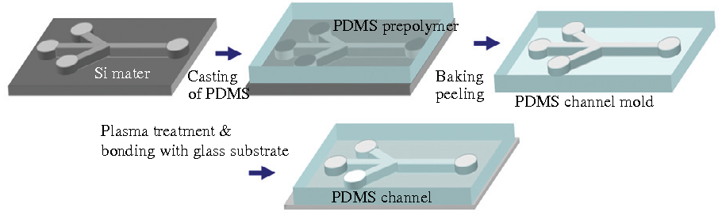
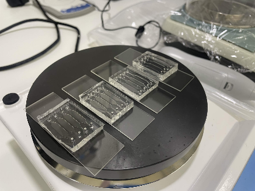

# Challenge -1: Organoid sorting

## Brainstorming on possible microfluidic device configuration

### 1. Passive spiral sorter without active sorting

A possible way to sort particles of different sizes passively is using a spiral microfluidic device with 2 inlets and several outlets. Over the course of flow, the particles can be separated based on inertia and centrifugal forces. Since the real time imaging and feedback-controlled sorting was a deliverable of the course, the spiral sorter chip wasn’t used.

### 2. Microfluidic device with detection and hydrodynamic actuation

A possible solution to sort particles based on the size was using a microfluidic channel with hydrodynamic actuation using image driven flow control (as shown in the figure below). Briefly, the organoids can be injected and spaced using a sheath flow towards the imaging area, where the detection and analysis occur. Once the sorting decision is made, the flow is actuated within the channel to drive the organoids into one of the collection channels.

### 3. Simple microfluidic device for imaging and sorting controlled by linear collection control

The third option was to use a simple microfluidic device (single inlet and single outlet) for imaging the organoids on chip and automating the collection. The mold for the Eppendorf tubes was 3D printed and mounted on a X-Y linear motor. The imaging, analysis an

## Microfabrication

We used two methods to fabricate the microfluidic devices used for the project.

### 1. Laser cutting

PMMA sheets as well as dual sided tape were cut using a CO₂ laser (add a link to the laser cutter).

Laser-cut microfluidic devices were rapidly fabricated by structuring poly(methyl methacrylate) (PMMA) sheets and assembling them with double-sided adhesive tape as an intermediate spacer and bonding layer. In this approach, channel geometries and inlet/outlet ports were first defined in CAD and transferred to PMMA and adhesive films using a CO₂ laser cutter, with the adhesive layer typically determining the channel height (180 µm). After cutting, the layers were aligned using inlet holes and laminated together by pressing the adhesive between rigid PMMA substrates, forming enclosed microchannels without the need for cleanroom processing.

### 2. Soft lithography

Soft lithography is the standard method for fabricating microfluidic devices due to its high resolution and reliability. PDMS stamps were prepared by pouring a mixture of PDMS elastomer and curing agent (typically in a 10:1 weight ratio) over a microstructured silicon wafer mold. The mixture is degassed to remove air bubbles and then cured at elevated temperatures (typically 65-150 °C). After curing, the PDMS layer was peeled from the mold, diced into individual devices, and inlet / outlet ports are created using biopsy punches. The PDMS devices were subsequently cleaned and irreversibly bonded to glass substrates using oxygen plasma treatment, forming enclosed microfluidic channels.

[Soft lithography reference DOI](https://doi.org/10.1002/(SICI)1521-3773(19980316)37:5%3C550::AID-ANIE550%3E3.0.CO;2-G)

